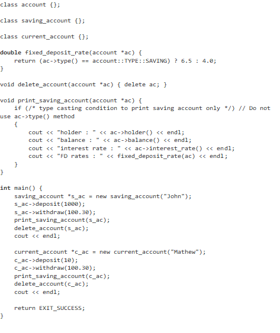

### Aim of the Experiment

 Design a class named account, saving_account & current_account as below. It should satisfy the test cases(TC) mentioned in the main function.

### Template Code

### Expected Output

holder : John 

balance : 899.7

interest rate : 4.5

FD rates : 6.5

saving account of John deleted

current account of Mathew deleted

### Key Learnings
• Inheritance

• Virtual Method

• Virtual Destructor

• Enumerated types

• C++ typecasting
