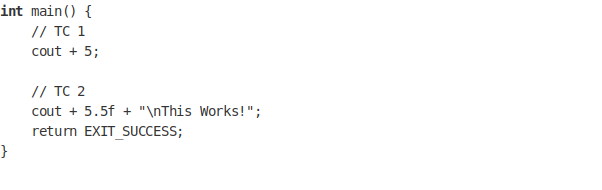

### Aim of the Experiment

To print the integer on output we generally use a statement like `cout << 5;`. Make `cout + 5;` statement to work as ` cout << 5;`.

### Template Code

### Expected Output

55.5

This Works!

### Key Learnings

Operator overloading

How printing(i.e. cout statement) works internally in C++.

