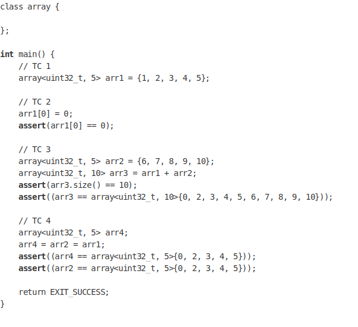

### Aim of the Experiment

Design a class named array which works exactly like a primitive array. Except it has following extra functionality:

### Template Code

### Expected Output

Code compiles & assert statements pass

### Key Learnings
• Operator (subscript, == & +) overloading

• Initializer list

• Template & Template Specialization

• Assignment operator

• Destructor

